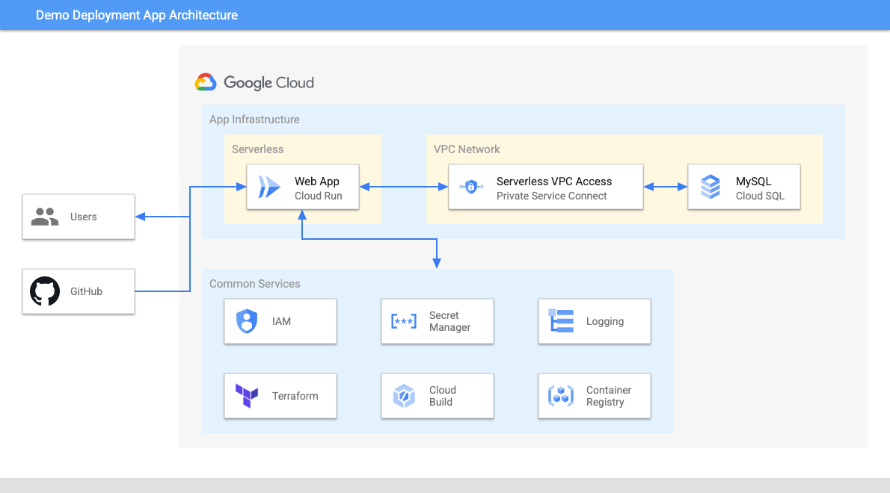
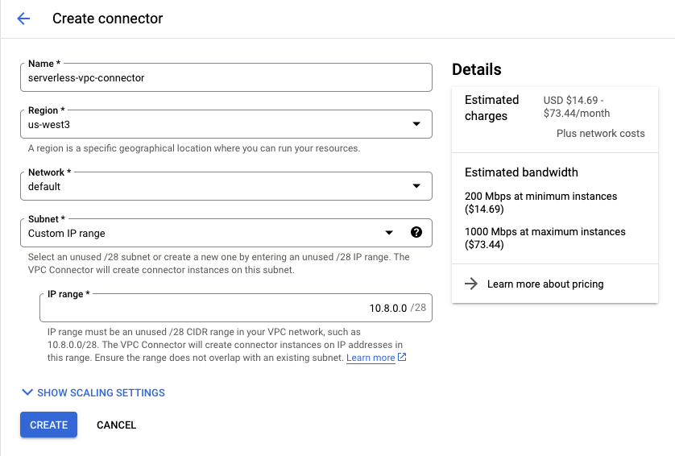
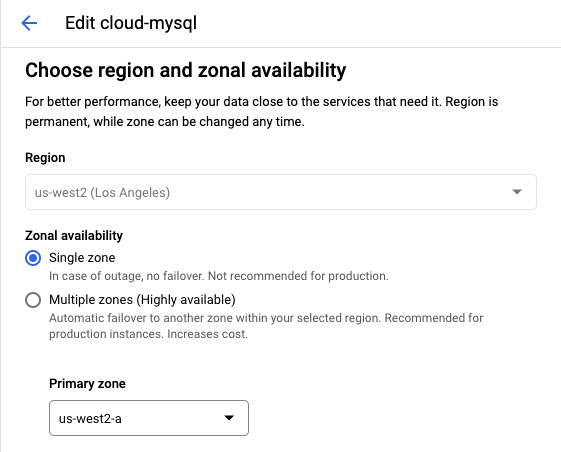
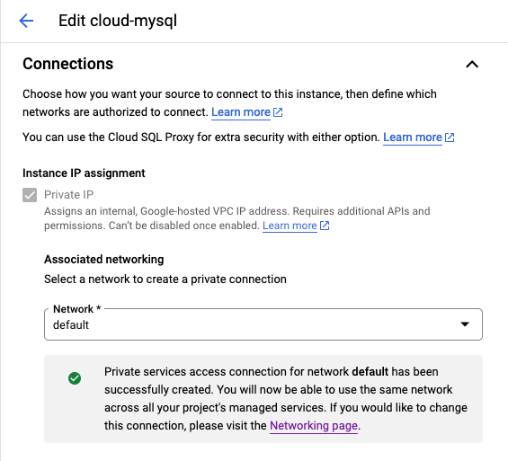
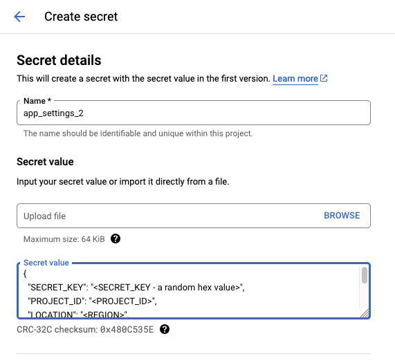

# GCP Demo Deployment Web App

## Introduction 
The Demo Solution Development App is a web-based application that allows you to deploy Google Cloud Platform (GCP) solutions with just a single click. The app provides a library of pre-built GCP solutions that you can choose from, and it takes care of all the deployment and configuration details for you.

The app is designed to make it easy for you to get started with GCP, even if you don't have any prior experience with cloud computing. With the Demo Solution Development App, you can quickly deploy a fully-functional GCP solution and start using it right away.

The app is also a great way to learn about the different GCP services and how they can be used to build real-world applications. By deploying the pre-built solutions, you can see how GCP can be used to solve a variety of problems.

## Features

The Demo Solution Development App includes the following features:

- A user-friendly web interface
- A one-click deployment process
- Admin can onboard pre-built GCP solutions

## Architecture


## Deployment Guide on GCP

- Provision a VPC network with subnet creation mode - Custom or Automatic
- Set up Serverless VPC Access for the VPC network. Please refer to the screenshot below.
  
- Deploy a Cloud SQL - MySQL instance into a GCP region. Please refer to the 2 screenshots below.
  
  
- Use the Secret Manager to store OAuth 2.0 Client info - Client ID and Client Secret and Cloud SQL connection info - Host IP, User ID and Password. Make a copy of ```config/settings-sample.json``` and update it for your need. Please refer to the screenshot below for creating the secret.
  
- Deploy the App to Cloud Run using Cloud Build
  - Modify the cloudbuild.yaml to use your own PROJECT_ID, _REGION and _CONNECTOR.
  - Run this command ```gcloud builds submit -f cloudbuild.yaml``` in Cloud Shell.

